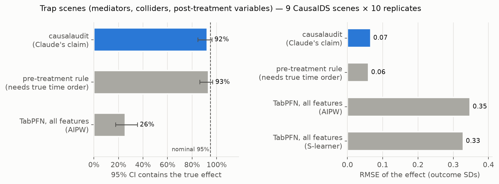
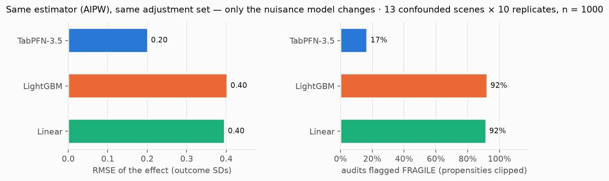
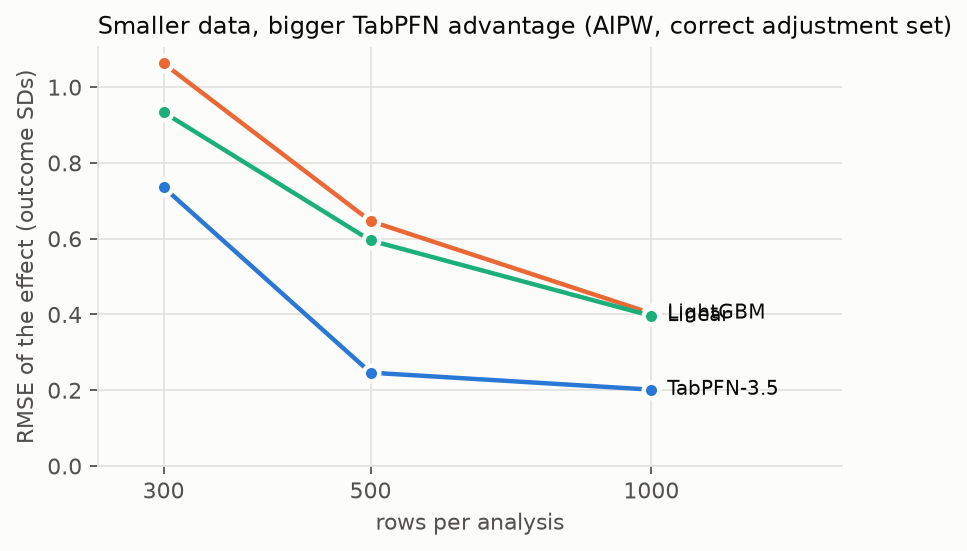
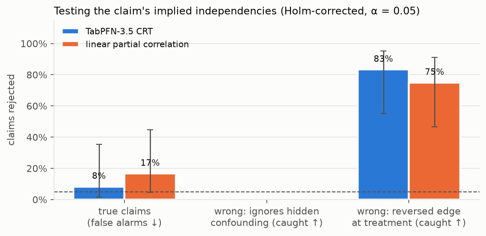

# causalaudit — TabPFN-3.5 audits causal claims

> **An agent proposes the causal story. TabPFN-3.5 tests every assumption against the data —
> and estimates the effect only from assumptions that survive.**

Ask a model "does X cause Y?" and it will answer confidently — even when the data cannot tell.
Hand it every column and it silently adjusts for mediators, colliders and post-treatment
variables. LLM agents make this worse: they tell a convincing causal story, then control for the
wrong things. `causalaudit` makes the assumptions explicit and puts TabPFN-3.5 to work twice:

1. **Falsify.** Every causal graph implies conditional independencies. Each one is tested with a
   **TabPFN-3.5 conditional randomization test** (TabPFN-CRT, `tabpfn-extensions`): TabPFN models
   the target *and* simulates the tested variable from its full predictive distribution —
   nonlinear, mixed-type, small data, no tuning.
2. **Estimate.** A cross-fitted doubly-robust (AIPW) estimator whose propensity and outcome models
   are TabPFN-3.5 — local open weights (3.5 / 3.5-Fast) or the Prior Labs API (Plus / Thinking).

Claude (the agent) writes the assumptions as a versioned YAML causal graph **before seeing the
data**; everything downstream is deterministic and reproducible without Claude.

```
claim.yaml ─► identification ─► falsification ─► overlap ─► AIPW estimate ─► verdict
 (Claude,      adjust / forbid    TabPFN-CRT       check      TabPFN-3.5        + E-value
  blind)                                                       nuisances
```

## Results at a glance

All numbers below are produced by the code in this repo from the logs in `results/`
(`results/causal/summary.md`). CausalDS = third-party benchmark with known ground truth.

| claim | evidence |
|---|---|
| **Handing every column to TabPFN gets causal effects wrong; the audit fixes it** | CausalDS trap scenes (mediators, colliders, post-treatment vars; 9 scenes × 10 reps): true effect inside the 95% CI **92%** of the time with causalaudit vs **26%** for AIPW on all features; RMSE 0.07 vs 0.35 SD |
| **TabPFN-3.5 makes the estimator 2× more accurate — and the audit usable** | 13 confounded scenes, same estimator & adjustment set: RMSE **0.20** (TabPFN) vs 0.40 (LightGBM) vs 0.40 (linear) SD at n = 1000; **0.41 vs 0.94 / 0.68 at n = 300**. Calibrated propensities: only **17%** of audits flagged for poor overlap vs **92%** with LightGBM or linear |
| **TabPFN-CRT catches wrong assumptions without crying wolf** | false alarms on true graphs **2.6%** (TabPFN-CRT) vs **26%** (linear partial correlation). At a matched false-alarm rate, wrong graphs caught: **90% vs 67%** (reversed edge at treatment), **48% vs 0%** (ignored hidden confounding) |
| **Claude's blind claims are right — and stay testable** | correct adjustment decision in **33/33** CausalDS scenes, written from the story alone, frozen by hash before any estimate |
| **Real data: quitting smoking → weight gain (NHEFS)** | **+3.50 kg [2.53, 4.46]** — matches the textbook 3.4–3.5 kg; "TabPFN on every column" gives +2.45 kg (30% too low). The audit also caught a wrong part of the agent's own story — and showed it doesn't affect this answer |

## Quick start

```bash
uv sync                      # Python 3.11–3.13; CUDA PyTorch on Windows/Linux, default wheels on macOS
cp .env.example .env         # add TABPFN_API_KEY (https://platform.priorlabs.ai/account/api-keys)
# one-time: accept the TabPFN-3.5 license at https://ux.priorlabs.ai (Licenses tab) for the local weights
uv run causalaudit audit --data data/nhefs/nhefs.csv --claim claims/nhefs/claude.yaml --out results/nhefs/claude
uv run pytest                # unit tests
```

In Claude Code, `/audit <data.csv> <codebook.md> <name>` runs the whole agent loop: a blind
subagent writes the claim from the data dictionary, the claim is hash-frozen, the audit runs, and
a rejected claim is revised as a *new* versioned file (never edited in place).

## 1 · Real-world demo: does quitting smoking cause weight gain? (NHEFS)

A blind Claude subagent read only the [data dictionary](examples/nhefs/codebook.md) (column
meanings + *when* each was measured) and wrote [its causal claim](claims/nhefs/claude.yaml).
[The audit](results/nhefs/claude/audit.md):

- **Forbidden controls found:** `smkintensity82_71` (mediator: change in smoking 1971→82) and
  `death` (post-treatment).
- **Unmeasured confounding named:** the agent added a latent *incident illness* ("sick quitters"
  quit *and* lose weight). Under its own claim the effect is therefore **not identified** — so the
  audit reports the effect *conditional on* that confounder's absence and an E-value of **2.4**
  (risk-ratio strength it would need with both quitting and weight change to explain the effect away).
- **The data contradicted part of the agent's story.** The claim says the 1982 state cigarette price
  (`price82`) relates to baseline covariates only via race and income. TabPFN-CRT rejected 3 of the
  9 implied independencies (education, smoking intensity, alcohol use; Holm p < 0.001).
- **The agent revised — on the record.** Shown only the audit report, a fresh subagent wrote
  [`claude_v2.yaml`](claims/nhefs/claude_v2.yaml) (state of residence also shapes education,
  smoking and drinking; v1 left untouched, both [hash-frozen](claims/nhefs/MANIFEST.sha256)).
  [v2's audit](results/nhefs/claude_v2/audit.md) still finds one contradiction (exercise).
- **Do the failures matter?** For each contradicted independency the audit tries every local repair
  (an edge either way, or a hidden common cause) and checks whether the adjustment set stays valid.
  Here none of them changes what must be adjusted for — verdict *PARTLY REJECTED, INCONSEQUENTIAL* —
  and the estimate is identical under v1 and v2. We stop revising here rather than fit the claim to
  the data.

| approach | effect of quitting on weight change (kg) |
|---|---|
| naive difference in means | +2.54 [1.59, 3.50] |
| "hand every column to TabPFN" (S-learner incl. mediator & post-treatment vars) | +2.45 |
| AIPW adjusting for every column | +3.22 [1.55, 4.89] |
| **causalaudit** — AIPW, TabPFN-3.5-Fast (local) | **+3.50 [2.53, 4.46]** |
| causalaudit — TabPFN-3.5 (local open weights) | +3.50 [2.54, 4.46] |
| causalaudit — TabPFN-3.5 via API (`v3.5`) | +3.50 [2.54, 4.46] |
| causalaudit — TabPFN-3.5 **Thinking** via API | +3.56 [2.51, 4.61] |
| textbook (Hernán & Robins, IP weighting / standardization) | +3.4 [2.4, 4.5] / +3.5 [2.6, 4.5] |

All TabPFN-3.5 modes agree; the local open weights reproduce the hosted API to the 4th decimal
on this all-numeric table ([`examples/nhefs/modes.py`](examples/nhefs/modes.py),
[`results/nhefs/modes.jsonl`](results/nhefs/modes.jsonl)).

## 2 · Benchmark: CausalDS (ground truth we did not write)

[CausalDS](https://github.com/andleb/causalds) (arXiv 2607.08093) scenes are synthetic causal
systems with realistic variable names, a natural-language story, generated data, and known true
effects and graphs. We use all **33 clean, binary-treatment scenes**: 22 identifiable (9 contain
traps where adjusting for every covariate is invalid) and 11 with hidden confounding (the right
answer is *not identifiable by adjustment*). CausalDS was released after Claude's training cutoff.

**Blinding & pre-registration.** For each scene a fresh Claude subagent read only the story and
column names ([prompt](prompts/elicit_claim.md)) and wrote a claim. All 33 claims were frozen in a
[SHA-256 manifest](claims/causalds/MANIFEST.sha256) before any Claude-arm estimate was computed.
Result: **33/33 correct adjustment decisions** (valid set, or correctly "not identifiable").
Because the stories are clear, Claude's graph ≈ the true graph here — so the benchmark measures
what the *harness* does with a claim, and E2 measures what happens when a claim is wrong.

### E1 — estimation (does the effect land where it should?)



- In trap scenes, causalaudit's CI covers the true effect **92%** [87–97%, scene-clustered bootstrap]
  of the time; AIPW on all features **26%** [4–51%]; TabPFN S-learner on all features has 5× the error.
- A competent "adjust for everything measured before treatment" rule does as well (93%) — but it
  needs the true time order, which Claude reconstructed from the story alone.




- Same estimator, same adjustment set, only the nuisance model changes: TabPFN-3.5 halves the
  error at n = 1000 and the gap widens as data shrinks (n = 300: 0.41 vs 0.94 LightGBM / 0.68 linear).
- TabPFN's propensities are calibrated: 6% clipped on average vs 44% (LightGBM) — so the audit's
  overlap check flags 17% of analyses as FRAGILE vs 92% with LightGBM or linear models.
  Among unflagged analyses, TabPFN coverage is **96%** at n = 300, 500 and 1000.

### E2 — falsification (does the data catch a wrong claim?)



Wrong claims are generated from the true graph: *ignore the hidden confounder*, or *reverse an
edge at the treatment* (mediator ↔ confounder, collider ↔ confounder). Some reversals are
**Markov-equivalent** on the tested independencies — no test can detect them; we report those
separately as "untestable" instead of counting them as misses.

- TabPFN-CRT: **2.6%** false alarms on true graphs (calibrated); linear partial correlation **26%** —
  it reads nonlinear dependence as a violation and would reject one in four *correct* graphs.
- At a matched false-alarm rate (≤ 5%), TabPFN-CRT catches **90%** of detectable reversed edges
  (linear 67%) and **48%** of ignored hidden confounders (linear **0%**) at n = 2000.

## Limitations (read these)

- Hidden confounding is only testable through what it implies (e.g. instrument–outcome dependence);
  power at n = 2000 is moderate (48%) and scene-dependent. Untestable assumptions are reported as
  such and covered by the E-value, not "verified".
- Binary treatments only (AIPW). CausalDS's truth is itself a Monte-Carlo estimate.
- The CRT p-value uses a normal approximation to the B = 100 permutation null (the rank p-value is
  floored at 1/101, which would make multi-test claims unrejectable after Holm); calibration is
  checked empirically by the false-alarm rate above. Claims test at most their first 8 implied
  independencies.
- Replicates are disjoint subsamples of each scene's 16k rows; CIs are clustered by scene.
- `tabpfn-extensions` 0.6.3 needed a small dtype fix for TabPFN-3.5 regressors (patched at runtime
  in `falsify.py`).

## Reproduce everything

```bash
uv run causalaudit bench e1 --n 1000 --reps 10                                  # E1 (~2 h on an RTX 3070)
uv run causalaudit bench e1 --n 300 --reps 20 --arms oracle --no-trap-only --out e1_small_n.jsonl
uv run causalaudit bench e2 --n 2000 --reps 3                                   # E2 (~3 h)
uv run python -m causalaudit.analyze                                            # results/causal/summary.md
uv run --group figures python -m causalaudit.figures                            # README figures
```
CausalDS files are downloaded on demand from Hugging Face; Claude's claims are already in
`claims/` (re-running the elicitation needs Claude Code; see `prompts/`).

## Layout

```
src/causalaudit/  claim.py (graph logic) · falsify.py (TabPFN-CRT) · estimate.py (AIPW)
                  audit.py (pipeline + report) · causalds.py / bench.py / analyze.py / figures.py
claims/           blind Claude claims + hash manifest      prompts/   exact elicitation prompts
examples/nhefs/   data dictionary + modes script            data/nhefs/  NHEFS analysis file
results/          benchmark logs, figures, audit reports    tests/     unit tests
.claude/commands/ the /audit agent command                  CLAUDE.md  agent rules
```

## Credits & license

Apache-2.0. Built on [TabPFN](https://github.com/PriorLabs/TabPFN) and
[tabpfn-extensions](https://github.com/PriorLabs/tabpfn-extensions) (TabPFN-CRT) by Prior Labs.
Benchmark: [CausalDS](https://github.com/andleb/causalds) (data CC0). NHEFS: Hernán & Robins,
*Causal Inference: What If* (public data via [Rdatasets](https://vincentarelbundock.github.io/Rdatasets/)).
Related work we build on or differ from: Causal-Copilot, CausalGuard, PyWhy-LLM (LLM causal agents),
Do-PFN / CausalPFN (causal foundation models), DoubleML's TabPFN example.
